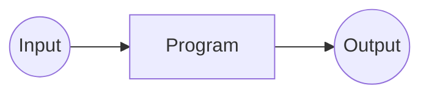

# Code Complete v2

[TOC]

- p57:
  - “迷信” 指的是你对代码的感觉代替对代码的理解｡
  - 如果你不知道为什么它是有效的,那就研究并讨论它,或者用替代方案重新实现一次,直到你弄明白为止｡
- p59:
  - 程序中参数个数的合理上限应该是七个左右｡

## 5 高质量子程序特点

### 5.1  生成子程序的原因

1. 降低复杂性
2. 避免代码重复
3. 减少改动带来的影响
4. 隐含顺序: PopStack() 决定顺序
5. 方便改进性能
6. 集中控制
7. 隐藏数据结构
8. 隐藏操作指针
9. 隐藏全局变量: 鼓励思考数据是不是全局的
10. 提高可移植性
11. 分隔复杂操作
12. 方便测试简单

- 简单的程序也可以放到子程序中
  - 如  `(x = a + (b/c), c != 0);` 的实现, 可以用带有具体意义的函数名包装

### 5.2 子程序名称恰当

- 强调过程: PrintReport(), CheckotDerInfo()
- 面向对象: Report.Print(), OrderInfo.Check()
- 强调返回值的名字:Cos(), PrinterReady(), CurrentTime(),

- 区分不同操作:
  - `Get`InputChar(): 将清除输入缓冲区
  - `Query`InputChar(): 不清除

### 5.3 强内聚性

单一职责原则的子程序更不容易出错

#### 5.3.1 好的内聚

- 功能内聚:Sin(), GetXXName(), EraseFile()
- 顺序内聚: 比如文件操作:
  - 打开,读,逻辑操作,输出结果,关闭文件
    - 这时候拆开就没有意义
  - 如果命名困难,可以考虑改用`功能内聚`
- 通讯内聚: GetNameAndChangePhoneNumber(), 一定程度上可以接受
- 临时内聚: Startup(), Shutdown(),
  - 如 Startup(): 读配置文件,初始化临时文件,建立内存管理
    - 可以做几个子程序让Startup() 调用, 而不是自己完成.

#### 5.3.2 不好的内聚

- 过程内聚: 多个可以`功能内聚`的代码集合
- 逻辑内聚: 通过传入一个`控制标志`来决定子程序处理的内容
  - 如果函数只是充当`事务处理中心`, 那是可以接受的(如 rust 的 `match`)

#### 5.3.3 内聚举例

- 功能内聚: 计算年龄和退休时间
  - 函数①: 根据 `生日` 计算年龄
  - 函数②: 根据`函数①`的结果, 再计算退休时间

`不要忘了问题的关键不是争论它具有哪种不好的内聚性，而是如何改善其内聚性`

### 5.4 松散耦合性

[ 耦合 != 内聚 ], 耦合指的是两个子程序之间的紧密程度

#### 5.4.1 耦合标准

- 耦合规模: 越小越好, 越松散越好
- 密切程度: 判断标准: 两个子程序中的参数
- 可见性:
  - 参数传递是明显的 => :+1:
  - 修改隐藏的参数 (全局参数) => :-1:
- 灵活性: `指改变两个子程序之间联系的容易程度`

`简而言之，如果一个子程序越容易被其它子程序调用，那么它的耦合程度也就越低。这样 的好处是可以增强灵活性和维护性`

#### 5.4.2 耦合层次

- 简单数据耦合: 只传基础数据类型
- 数据结构耦合: 传结构体的
- 控制耦合: 传控制信号的, 通常不太好
- 全局数据耦合: 如果数据是`只读的`还可以忍受. 但还是不受欢迎, 因为`全局变量和调用者的联系`总是容易被遗忘的
- 不合理耦合(pathological): `如果一个子程序使用了另外一个子程序中代码，或者它改变了其中的局部变量，那么它们就是不合理耦合`

#### 5.4.3 耦合举例

- 简单的: Sin(), GetName()
- 可接受的数据结构: 把 [含有 5 个 field 的结构体] 传到另一个子程序中, 并使用全部的 field.
- 不可接受的数据结构: 只使用了其中两个 field, 但是还是传了整个结构体, 这不好
- 有问题的数据结构耦合:
  - 一个有 27 个 field 的结构体传递, 而只使用了其中 16 个 field.
  - 可以考虑将结构体再细分成多个子结构体
- 控制耦合: A -> B 传递控制标志, 决定打印月报表,季报表还是年报表
- 不可取全局耦合: 改动了全局变量
- 可取全局耦合: 只读全局变量

`子程序本来是用于降低复杂度的工具, 如果使用它没有使工作更简单, 那说明没有用他更好.`

### 5.5 子程序长度

- 小于 200 行: ok
- 大于 200 行: 小心注意了

修复成本也与行数有关

### 5.6 防错性编程

#### 5.6.7 使用"防火墙"包容错误带来的危害

在程序中构建防火墙的最好办法是吧某些接口标识成"安全"边界. 对穿越安全区边界的数据镜像合法性检查, 如果是非法的数据, 要对其进行消毒处理, 手术室中的一切都认为是无毒安全的.

最简单就是`在外部数据进入时进行消毒`

#### 5.6.9 在最终软件中保留多少防错性编程

- 去掉那些无关紧要错误的代码: `去掉`并不是指物理上去掉, 它指的是版本控制预编译开关.
- 如果不存在空间限制问题, 也可以保留这段查错代码, 并让它向 Error log 隐蔽地传递信息.
- 保证留在程序中的错误提示信息是友好的.
- 过多的防错性编程会带来它自身的问题.

### 5.7 子程序参数

- 约定: C语言中, 把被修改的参数放在`首位`
- 约定: 把`状态`和`错误`放在最后
- 没用上的参数就不要传
- 不要把传参当作 ( 临时变量 )使用
- 如果发现传递参数过多, 说明程序之间的耦合有写过于紧密了.
  - 这时候应重新设计子程序, 来降低耦合的紧密性.

## 6 模块化设计

### 6.1 模块的内聚与耦合

类似 5

### 6.2 信息屏蔽

#### 6.2.2 信息隐蔽举例

- 就是`private`和`public`, 如:

  ```rust
  // 1. 普通判断
  if node.next != nil {
    node = node.next;
  }

  // 2. 严谨判断
  if node != nil {
    if node.next != nil {
      node = node.next;
    }
  }

  // 3. 封装
  let node = NearestNeighbor(node);
  ```

  如果 `1.` 和 `2.` 在多处调用后再修改, 会很麻烦, 也容易被遗忘
  如果使用 `3.` 封装了以后, 只需要在封装内部修改就可以了

#### 6.2.3 常见需要隐含的信息

- 容易被改动的区域
  - 接口应该把变动限制在模块内部, 外部不会受到内部变动影响. 如:
    - 对硬件依赖的地方
    - 输入输出
    - 非标准语言特性(rust 的 Unsafe, WinApi 等)
    - 状态变量
      - 不要用`逻辑型变量`作为状态, 用`枚举型变量`

        ```rust
        // bad taste
        struct UserState {
          is_running: bool,
          is_resting: bool,
          is_sleeping: bool,
        }

        // good taste
        enum UserState{
          RUN
          REST
          SLEEP
        }
        ```

      - 用子程序进行`状态检查` (?)

    - 数据规模不要写死

      ```rust
      // bad taste
      if slices.len() > 15 { /* ... */ }

      // good taste
      const MAX_SLICES_LEN = 15
      if slices.len() > MAX_SLICES_LEN { /* ... */ }
      ```

    - 商业规则, 游戏规则: 单独写在一个地方
- 复杂的数据
- 复杂的逻辑
  - 只需要封装起来, 把结果暴露出来就好, 实现细节不必展示
- 程序语言上的操作
  
  ```rust
  // bad taste
  let employee_id = employee_id + 1;
  let current_employee = employee_vec[employee_id];

  // good taste
  let current_employee = next_available_employee(employee_list, employee_id);

  // (maybe) better taste
  let employee_struct = Employee::new();
  /* ... */
  let current_employee = employee_struct.next_available_employee(employee_id)
  ```

  ```rust
  // bad taste
  front_of_queue();
  back_of_queue();
  next_in_queue();
  // good taste
  highest_priority_event();
  lowest_priority_event();
  next_event();
  ```

#### 6.2.4 信息隐蔽的障碍

- 信息过度分散: 用全局(模块)变量
- 交叉依赖: 重构, 重新设计
- 误把模块数据当作全局数据
  - 一个子程序在对其进行操作时并不知道其它子程序也在对它进行操作
  - 这个子程序知道其它子程序也在对其进行操作, 但不知道它们对它干了什么
- 误认为会损失性能: 担心调用的性能损耗是不成熟的体现

### 6.3 建立模块的理由

面向对象

## 7 高级结构设计

### 7.1 软件设计

#### 7.1.2 软件设计的层次

子系统 1->N 子模块 1->N 子函数 -> 写实现

### 7.2 结构化设计

- 组成:
  - 系统组织: 系统被设计成几个黑盒子, 明确定义的子程序和模块, 接口的实现细节对其它子程序来说都是隐含的
  - 开发设计的策略
  - 评估设计准则
  - 关于问题的明确说明, 这是解决问题的指导原则
  - 表达设计的图形和语言工具, 包括 PDL 和结构图

#### 7.2.1 选择需要进行模块化的元素

- 自顶向下分解 -> 逐步求精
  - 主要子程序为顶 原则如下:
    - 设计高层次
    - 避免语言细节
    - 不指出下层的设计细节
    - 正规化每个层次
    - 检验每个层次
    - -> 转移到下一个层次, 重复动作 ↑
  - 多次分解, 并且试试看多种分解的可能性
  - 分解到什么程度? 知道下一步进行编码要比再分解要简单为止
- 自底向上合成
  - 原则:
    - 系统要做什么你知道哪些
    - 利用这一问题识别出某些低层次功能
    - 识别出这些层次功能共同的方面, 将其组合到一起
    - 向上一个层次, 进行同样的工作, 或回到顶端开始自顶向下

各有优缺点, 自己看情况使用

### 7.3 面向对象

dddd

### 7.4 各种设计方法的对比

1000 行以上 , 面向对象好
以下, 结构体足矣

### 7.5 往返设计

写完一次, 再写一次

在从事`低层次问题`时所获得的细节将为你`高层次的总体理解`和`作出总体设计决定`奠定下良好的基础, 这种高低层次间往返思维过程是非常有益的

#### 7.5.2 设计是个复杂的过程

说它是个复杂的过程也是因为你不知道什么时候设计方案已经足够完善了. 什么时候算完成呢? 对这个问题的通常答案是 "当你没有时间时"

#### 7.5.3 设计是个险恶的过程

怎么说? 因为很多时候, 我们需要先"解决"问题后, 才能有一个清除的定义和理解, 然后再重新解决一遍, 以获得正确的方法.

#### 7.5.4 设计是一个启发的过程

- 启发: 吃一堑, 长一智
- 最重要的设计原则之一是不要死抱着一种方法不放
  - `写PDL`, `作图`, `伪代码`, `写小程序验证`...
  - 或者用完全不同的方法: 暴力算法, 铅笔不停写和画...
  - 如果都没效果, 暂时放开这个问题, 出去自由自在地散步, 或者想一下别的, 然后再回到这个问题上.
  - 实在解决不了, 就暂时不考虑这个问题了...

#### 7.5.5 受欢迎的设计特点

- 智力的上可管理
- 低复杂度
- 维护方便
- 最小联系性: 保持子程序之间的联系最少的原则来设计
  - 以`强内聚`, `松散耦合`, `信息隐蔽`作为编码原则
- 可扩充: 功能变动时, 越不需要改动, 则表示代码的可扩充性越强
- 可重复使用性: 抽象成别的程序可以用的
- 高扇入: 对一个给定的子程序, 被调用的越频繁就越高扇入
- 低扇出: 对一个给定的子程序, 其调用的子程序越少就越低扇出
  - 但不是越低越好, 7 个以内都可以接受吧
- 可移植性
- 简练性: 最有害的观点是"多加入些又不会有害, 怕什么呢"
- 成层设计: 尽量分解的层次是成层的, 这样可以在每一个单独的层次上观察系统
  - 如果不得不借用许多旧的, 设计得不好的代码, 那可以在新的系统中建立一个层, 让它与旧代码连接, 把缺点隐含起来.
- 标准化技术

## 8 生成数据

### 8.2 自建数据类型的原因

```rust
// type 1
struct ForXYPlot(f64);
impl ForXYPlot {
  //...
}

// type 2
const MAX_SLICES_LEN = 15;
let employee_id = &str[0..MAX_SLICES_LEN];
```

- 使得改动更加容易
- 避免过度分散的信息分布
- 为了增加可靠性
- 补偿语言的弱点

### 8.3 自建数据类型的准则

- 建立具有面向功能名称的类型
- 避免使用含有已定义变量类型的名称
- 避免使用已定义类型
- 定义替换类型以增强移植性
  - type INT = i64 / i32 : 64位系统是i64, 32位系统是 i32

### 8.5 初始化数据的准则

- 子程序的输入是否都有效?
- 是否在使用变量的位置附近进行了初始化?
- 是否恰当的对计数器和指针进行了初始化, 是否必要时对其进行重新初始化?
- 在反复执行的代码段中, 是否对变量进行了恰当地初始化?
- 编译是否有警告(现代编程语言基本有做了)?

## 9 数据名称

### 9.1 选名

- 易读, 易记忆且恰当

#### 9.1.2 面向问题

- 一个好记的名字应该是`面向问题`而`不是解决问题`

#### 9.1.3 最佳命名长度

- 较常使用的变量: 8 ~ 20个 字母之间
- 临时变量: 有时 1 个即可

#### 9.1.5 计算值的限定词

- 如 Ttl, Sum, Avg 等, 用到这些时, 需要将它们放到最后
  - 如 RevenueTtl, ExpenseTtl, RevenueAvg, ExpenseAvg

### 9.2 特定数据类型命名

#### 9.2.1 循环变量

- i, j, k
- xxxIndex, yyyIndex...

#### 9.2.2 状态变量

- 尽量不要用 flag
- 用更清晰的变量名会更好
- 当你发现自己"侦探"破了一段代码时, 应该考虑对变量重新命googlefonts名

#### 9.2.3 临时变量命名

- 如果可以, 也为临时变量如 Tmp, X 等进行功能性命名

#### 9.2.4 逻辑变量命名

- Done, Error, Found, Success: 非真即假的命名

### 9.3 命名约定

#### 9.3.1 好处

- 作出总体决定, 可以把精力放在更重要的程序特性上
- 可以借鉴其他项目的经验并移植到自己的项目上
- 可以快速熟悉新项目
- 防止一变量多名
- 弥补语言缺陷

#### 9.3.2 什么时候约定

- 多人协作时
- 需要给别人维护时
- 需要被 Review 时
- 项目规模过大时
- 当一个项目需要频繁使用某些不常见的词汇, 而又想开始编码时

### 9.4 非正式命名约定

#### 9.4.1 与语言无关的约定准则

- `g_`, `g.` 代表全局
- `T` 代表结构, 类型
- 用`驼峰命名法`或者`下划线命名法`

#### 9.4.2 与语言有关的命名约定

- 看语言相关的资料吧

#### 9.4.3 命名约定举例

### 9.6 短名称

#### 9.6.3 关于缩写的建议

- 缩写应保持一致性: 比如 Num 和 No.不要混用
- 使用容易发音的缩写: xPos 而不是 Xpsn, CurTotal 而不是 ntTtl
- 用近义词来避免冲突
- 为短名称写注释

### 9.7 要避免的名称

- 避免意义相似的名称: Input 和 InVal, RecNum 和 NumRecs 等
- 避免使用含义不同但拼写相似的名称:
  - ClientsRecs 和 ClientReps -> ClientRecords 和 ClientReports
- 避免使用发音相近的名称: Wrap 和 rap
- 尽量避免名称里使用数字
- 避免在名称中改写字母: 比如把 highlight 改成 hilite
- 避免常见容易拼错的单词
- 不要单纯通过大写区分变量名
- 避免使用标准子程序名和已定义的变量名
- 不要使用與變量所代表的的實體沒有任何聯繫的名字

## 10 變量

### 10.1 作用域

- 尽可能减少作用域
  - 少用全局变量：方便和危险不可兼得
- 尽可能使用局部变量：提高可管理性
  - 所隐含的信息越多，需要记住的东西就越少，则犯错机会越少
- 方便性和可管理性：
  - 方便性：强调`写`程序
  - 可管理性：强调`读`程序
- 把某一变量的引用集中放置
  - 在某一循环前初始化循环中需要用到的变量, 而不是在子程序开头对变量初始化, 方便修改
  - 要在用到某一变量时才对它进行赋值

### 10.2 持久性

- 保证自己正确地使用了变量
  - 在程序中假如调试代码来检查变量的值是否合理, 如不合理, 产生一个警告信息来提示检查不恰当的变量初始化
  - 在写代码时假定变量已失效
  - 养成在恰好使用某一变量之前对其进行初始化的习惯

### 10.3 赋值时间

- 通常, 越晚给变量赋值, 代码的灵活性遍越大
- 常量需要在编译时就定义, 使用时再赋值

  ```rust
  // bad
  let TestID = 15
  // good
  const MAX_ID = 15
  let TestID = MAX_ID
  // better: TestID is set from build
  let TestID = read_file_fro_max_id()
  // better: TestID is set with user input
  let TestID = get_max_id_from_user()
  ```

### 10.4 数据结构与控制结构关系

先想象可用的数据和输出该是什么样子, 然后对程序定义, 将输入转化为输出



- 顺序性数据: 可以转化为`if/else, case`
- 重复性数据: 可转化为`for, repeat, while, loop`等循环结构

### 10.5 变量功能单一性

- 应使每一个变量只具有一个功能
  - 如果是临时变量: 临时变量也最好用具体意义的名字定义
- 避免使用具有隐含意义的变量
- 避免不使用变量(有些编译器会警告(rust)或报错(golang))

### 10.6 全局变量

### 10.6.1 伴随全局变量的常见问题

- 破坏了可管理性
- 减弱了模块性

### 10.6.2 使用全局数据的理由

- 保存全局数据: 比如程序的状态
- 替代命名常量
- 方便常用数据的使用
- 消除"穿梭"数据

### 10.6.3 怎么降低使用全局数据的危险

- 先尝试将所有变成局部的, 变不了就试着变模块, 最后没法变的才是全局
- 区分全局和模块变量
- 建立使你一眼既可识别出全局变量的命名约定
- 不要通过把数据放入庞大的变量, 同时又到处传递它来掩盖你使用全局变量的事实

### 10.6.4 用存取子程序来代替全局变量

- 存取子程序的优点
  - 可以对数据进行集中控制: 以后找到了合适的数据结构, 只要修改子程序就可以了
  - 把所有对数据的引用分隔开来, 从而防止因其错误造成的影响蔓延
  - 自动获得信息隐蔽带来的好处
  - 存取子程序很容易转化成抽象数据类型
    - `if_page_full()` 代替 `if lineCount > Maxlines`
    - 虽然收益很小, 但是大量的这类差别便聚集成了高品质软件与东拼西凑到一起的软件之间的不同之处
- 不要把所有全局数据放到同一个模块中
  - 编写存取子程序前, 应先考虑一下每一全局数据应属于哪一个模块, 然后把这个全局数据/相应的存取子程序和其关联的子程序放入那个模块中.  
  - 把信息隐蔽在存储子程序后面, 可以使代码自己指出这些, 并且可以使得其他人从问题域而不是实现细节的层次上来阅读程序
- 把对数据的所有存取操作保持在同一抽象水平上
  - 如果`读数据`用了子程序, 那`写数据`也应该用子程序

## 11 基本数据类型

## 12 复杂数据类型

结构体

### 12.3.2 使用抽象数据类型(ADT)的好处

- 隐藏实现细节
- 将改动的影响限制在局部
- 减少修改时犯错的可能性: 最多就是调用错了子程序, 而这个错误又十分容易被发现
- 使程序成为自说明的
- 即使是简单的问题也应考虑使用抽象数据类型: Turn_Light_On(), Turn_Light_Off()

### 12.3.5 混合抽象级别(要避免)

- 当一个子程序直接用到了在其中的记录或结构的人一个域时, 便称这个域是开放的
- 如果记录或结构的任一个域都没有被直接使用, 那就成他是封闭的

## 13 顺序程序语句

### 13.1 与顺序有关的程序语句

- 利用参数传递表明依赖关系
- 写注释

### 13.2 与顺序无关的程序语句

- 使代码从上读到下, 而不要到处转移
- 使变量存活时间尽可能短
- 相关的语句组织在一起

## 14 条件语句

## 15 循环控制

## 16 少见的控制结构

## 17 常见的控制问题

### 17.1.3 编写肯定形式的布尔型表达式

DeMorgen 定律转化逻辑表达式

## 18 布局与风格

### 18.5

#### 18.5.3 把相关的赋值语句对齐

1. 等号未对齐

    ```go
    EmployeeName := InputName
    EmployeeSalary := InputSalary
    EmployeeBirthdate := InputBirthdate
    BossTitle := Title
    BossDept := Department
    ```

2. 等号对齐

    ```go
    EmployeeName      := InputName
    EmployeeSalary    := InputSalary
    EmployeeBirthdate := InputBirthdate
    BossTitle         := Title
    BossDept          := Department
    ```

3. 分类

    ```go
    EmployeeName      := InputName
    EmployeeSalary    := InputSalary
    EmployeeBirthdate := InputBirthdate

    BossTitle         := Title
    BossDept          := Department
    ```

## 19 文档

### 19.1 外部文档

- 大约要花工程的三分之二的力量

### 19.2 编程风格作文档

- 依靠好的编程风格来承担大部分的文档任务
- 在好的编码中, 注释可称得上是"锦上添花"

### 19.4 有效注释的关键

- 反对在进行编程时注释的观点: "当你集中精力写代码时, 不应该分散精力去写注释".
  - 正确的答案是, 假如你极其用心地写代码, 注释会打断你的思路, 则你需要先设计 PDL, 然后把 PDL 转化为注释.
  - 需要集中精力写代码是一个警告信号, 假如你的代码很难, 在你对代码的注释担忧前应简化它.

### 19.5 注释方法

- 把注释段集中在`为什么`而不是`如何`上
- 避免缩写: 注释应该是明确的
- 不要注释需要技巧的代码:
  - 注释不应当拯救困难的代码 -- 重新编写它
  - 假如你维护一个程序, 不想重写坏的代码, 那么注释那些需要技巧的部分是个好的练习

## 20 编程工具

## 21 项目大小如何影响创建

- 表 21-1 项目正规性明细表

## 创建管理

### 22.5 将程序员视为普通人

### 22.6 如何对待上司

## 23 软件质量概述

### 23.1 软件质量特点

- 外部: 用户关心的特征
  - 正确性: 整个系统受`说明`, `设计`, `实现` 的错误影响程度
  - 可用性: 系统易用度
  - 效率: 系统效率
  - 可靠性
  - 完整性: 防止非法或者不适当地访问. 完整性思想包括: 限制非法用户访问, 同时确保数据恰当访问; 数据并行修改; 数据段仅含有有效数据等等
  - 适应性: 可移植性
  - 精确性: 系统不受错误影响的程度
  - 坚固性: 系统对无效输入或压力环境中能继续执行其功能的能力
- 内部: 程序猿关心的
  - 可维护性
  - 灵活性: 修改系统使其能够适应于不同的用途或环境的能力, 而不必对系统进行特定的设计
  - 可移植性
  - 可重用性: 能将系统的`一部分`用于其他系统的难易度
  - 可读性
  - 可测试性
  - 可理解性

### 23.2 提高软件质量的方法

- 软件质量保证最好的方法是`控制软件的开发过程`
  - 质量管理目标: 从外部特征和内部特征挑选出明确的目标
  - 确定质量保证活动: 应该让程序猿名表质量是第一的
  - 测试策略: 详见 `25 单元测试`
  - 软件工程准则: 详见 `3.6 编程约定`
  - 非正式技术检查: 手工检查设计, 代码, 或整个代码的普查
  - 正式技术检查: 质量门(quality gate): 需求分析, 结构, 详情设计, 编码, 测试等
  - 外部检查: Code Review
  - 开发过程: 有质量保证活动的开发过程会比没有的好
  - 修改控制过程: 失控的修改会导致编码和设计的毁坏, 所以有效地处理各种修改是进行有效开发的关键
  - 结果的定量: 质量确计划应该是可衡量的
  - 原型: 原型是对系统关键功能的可实现模块的开发

### 23.5 软件质量的一般准则

- IBM: 如果不顾质量而只是想用最短的时间将软件开发出来, 往往很可能需要较长的时间和花费支出, 从一开始就着眼于取得最高可能质量和可靠性的软件开发, 易于取得最好的开发进度, 最高的生产效率甚至最好的市场成功率

## 24 评审 (QA)

## 25 单元测试

- 重要

## 26 调试

- 提高开发质量可降低开发消耗
- 靠猜测发现错误, 是十分令人痛苦的
- 请用最为明显的方式更改错误
- 不要`编程迷信`
- 假设错误是自己的, 可使你免受宣称某个错误是别人的, 而最后发现是你的而不得不改口的窘迫困境

### 26.2 找错

#### 26.2.1 科学调试方法

- 科学调试方法的步骤:
  - 通过重复试验收集数据
  - 建立假设以解释尽可能多的相关数据
  - 设计实验以便证实或否定假设
  - 证实或否定假设
  - 按要求重复以上步骤

- 发现错误的有效方法
  - 固定错误
  - 确定错误源
  - 改正错误
  - 测试修改
  - 寻找类似错误

#### 26.2.2 发现错误的诀窍

- 使用所有可能数据进行假设
- 细化测试用例
- 通过不同的方式再生错误
- 生成更多的数据以产生更多的假设
- 使用否定测试的结果
- 提出尽可能多的假设: 有助于打破侧重于某一个原因所引起的调试僵局
- 缩小可疑代码区域
- 怀疑已发生过错误的子程序
- 检查最新修改过的子程序
- 耐心检查, 少走捷径
- 检查一般错误: 按照 `24.2` 检查
- 跟其他人讨论问题: `交谈调试` 典型的
- 暂时终止对问题的思考

### 26.3 修改错误

- 理解整个程序
- 确诊错误
- 放松自己
  - 急于解决某一个问题是最浪费时间的事情, 他可导致`草率的判断`, `不正确的错误诊断`, `不彻底的修改`
- `保存初始源代码`(改正前)
- 修改错误问题, 如果没透彻地理解问题, 你就不应该修改代码, 如果仅修改症状只会使代码质量变坏
  - 修改并不是在任何情况下都奏效
    - 问题也可能是初始化错误 (配置文件错误)
  - 他是不可维护的, 特殊用例的代码
  - 使用计算机来计算比人工计算更为有效.
- 每次只作一个修改
- 检查你的修改
- 重新运行整个程序以检查你所作修改的副作用
- 寻找相似错误

## 27 系统集成

### 27.1 集成方法重要性

- 好的集成带来的好处:
  - 易于诊断错误
  - 更少的错误
  - 少量连接框架
  - 在短期内形成首次可工作系统
  - 短期的全面开发计划
  - 增强信心
  - 增加工程完成的机会
  - 更可靠的预测计划
  - 更准确地了解工程情况
  - 提高代码质量
  - 减少文件

## 28 代码调整策略

### 28.1 功能描述

- 性能质量与功能
  - 如果你提高代码运行速度而牺牲其他性能, 这不但不能改进功能, 还会损害功能
- 功能与代码调整: 可以考虑以下几点提高效率
  - 程序设计
    - 每个系统定制自己的空间和速度目标
    - 目标清楚明白, 实现才越容易
    - 可以制定一个长远看能提高效率的目标
  - 模块与子程序设计
  - 操作系统相互作用
  - 代码编译
  - 硬件
  - 代码程序设计

### 28.2 代码调整介绍

## 29 代码调试技术

## 30 软件优化

### 30.1 软件进化种类

- 软件进化所作的调整是结构性的还是维护性的
  - 结构性调整: 开发者完成, 还未上线的, 面临压力只是进度上的
  - 维护性调整: 压力在于用户的指责上

### 30.2 软件优化指南

- 多设计子程序
- 减少全局变量
- 改进你的编程风格
- 改变管理
- 重审修订后的程序
- 程序猿小心地进行着修改
- 重测试

## 31 个人性格

### 31.1 个人性格是否与本书的主题无关

- 如果你想成为一个高手, 你得全靠你自己下功夫
- 你无法改变自己的聪明程度, 但是你可以在一定程度上改变自己的性格
  
### 31.2 聪明与谦虚

- 好的智力是和常为一个好的程序猿有着并不紧密的联系
- 实际上, 那些使用各种方式弥补错误的谦虚的程序员们所编写的程序, 即易为自己也易为别人所理解, 并且其程序中所含错误也少. 实际的弯路是出现错误和影响进度的路
-

### 31.3 好奇心

- 在开发过程中建立自我意识
- 实验: 如: 了解所用语言的工作过程
- 阅读解决问题的有关方法
- 在行动之前分析和计划
- 学习成功项目的开发经验
- 阅读他人的代码, 并寻找差异
- 阅读手册
- 阅读相关书籍和期刊

### 31.4 诚实

- 不假装你是一个编程高手
- 乐于承认自己的错误
- 力图理解编译器警告信息而不是对其置之不理
- 对你的程序有一个清晰的了解, 而不是进行编译看看是否有错
- 提供实际状态报告
- 提供实际方案评估, 在上司面前坚持自己的意见

### 31.5 交流和合作

- 初学者: 能够使用子程序, 循环, 条件语句和其他许多语言特征
- 中间者: 有使用多种语言的能力, 并且非常熟悉某一种
- 专家: 对其语言或环境这两者有着很深的造诣, 这种级别的程序员对公司有价值的
- 大师: 编写的代码是给人看的, 会建立有关文档

- 你不被为自己是初学者或中间者而内疚, 你同样不必为自己是专家而不是大师自愧, 在你知道怎样提高自己的水平后, 你倒是应该为自己`停留`在初学者或专家的水平上`有多长时间`而内疚

### 31.6 创造力和自律

- 一个杰出的程序员需要遵守许多规则, 如果你在开始编码之前不分析需求就进行设计, 你将在编码过程中学不到关于项目的许多东西. 你的工作的结果看起来更像三岁小孩的手指画, 而不是一件艺术品

### 31.7 懒惰

- 拖延自己讨厌的工作
  - 真懒惰
  - 没有任何益处
- 迅速地将自己讨厌的任务做完以摆脱任务
  - 明懒惰
  - 通过在自己所讨厌问题上花费尽量少的时间来避开问题
- 编写一个工具来完成自己讨厌的工作以解脱自己
  - 长期懒惰
  - 只要你通过编写工具最终节省了时间, 就是积极的

### 31.8 不是你想象中那样起作用的性格

### 31.9 习惯

- 好的习惯起作用是由于你为一个程序员所作的大部分事情是在你无意识中所完成的
- 当你开始学习某一件事时, 你应按照正确的方式学好它
  - 当你开始学时, 你已对其进行了思考, 并且你可在正确或错误的途径间作出轻易的选择. 一段时间过后, 你对你所作的不太注意, 此时"习惯的力量"会开始起作用, 确保其作用的习惯是你所希望的.
- 如果你没有养成最有效的习惯, 应该怎么办?
  - 你无法用`没有习惯`取代`坏的习惯`
  - 你应该养成在编写代码之前编写 PDL (流程图) 和在编译之前阅读代码的习惯, 你不必为失去坏习惯而多虑.
  - 在用新习惯取代后, 坏习惯会自然而然消失的

## 32 软件开发方法的有关问题

### 32.1 克服复杂性

- `子程序`越独立, 复杂度越得以降低
- 使用`全局数据`是有害的
- 如果设计的子程序之间有`全局变量共享`或`粗糙定义的接口`, 你也会遇到许多复杂的问题
- 复杂性可以通过`好的设计`得到最大程度的降低
- `编码约定`在某种程度上同样可降低复杂性
- 使用层次结构

概括地说, 软件设计和编码主要目标是克服复杂性, 许多编程风格的目的也就是降低复杂性. 对程序员来说, 降低复杂性是一个很关键的问题

### 32.2 精选开发过程

- 对大, 小过程的观察意味着你停下来留神自己是怎样创建软件的, 这是值得你花时间的.
- 认为"代码才是真正有作用的, 你应该侧重于代码的质量, 而不是某些抽象的过程"是缺乏远见的, 它忽视了许多实际的证据
- 软件开发是一种创造性的活动, 如果你并不理解这回一个创造性的过程, 你就不能很好地利用你的大脑
- 坏的过程浪费你的脑力, 而好的过程则能很好地利用你的脑力

### 32.3 首先为人编写程序, 其次才是计算机

- 可读性对程序的积极影响:
  - 可理解性
  - 可检查性
  - 错误率
  - 调试
  - 可修改性
  - 开发时间
  - 外部质量

- 可读性代码的编写并不费时
- 可读性代码不是可有可无的
  - 你应该力争一次就编写出好的代码, 而不再费神去阅读较差的代码
- 区分别人的代码`是否是有争议`对你是有益的

### 32.4 注意约定使用

- 约定能精确地传递重要的信息
- 约定可以防止一些已知的危害
  - 通过禁止全局变量和在一行中写多条语句的使用等
- 约定可提高低级任务的预测性
  - 对 CPU 请求, 错误处理, IO, 子程序接口的约定可使你的代码结构良好, 并让其他程序员易于理解你的代码
  - 不用`goto`可以排除一种非约定的控制结构 -- 你很难知道`goto`是向上还是向下跳转的
- 约定可以弥补语言的不足

### 32.5 根据问题范围编程

- 高级代码不应被一下细节所填满: 文件, 堆栈, 队列, 数组, 和一些字符如 i,j,k 等
- 高级代码应该是对要解决问题的描述, 它应由确切表明程序功能的`描述性子程序`封装而成
- 将问题费分解成不同抽象级
  - 第一层: 高级语言结构
    - 原始数据类型, 控制结构等
  - 第二层: 计算机科学结构
    - 堆栈, 队列, 链表, 树, 索引文件, 搜索算法等等
  - 第三层: 低级问题领域
    - 你需要对问题的原始描述有所了解, 应该清楚问题的专业术语和积木块, 以便能解决问题
  - 第四层: 高级问题领域
    - 本级上的代码在某称程度上应是可读的, 一般的应用人员即可读懂

### 32.6 当心飞来横祸

- 认真对待`警告`
- 将`设计度量`用做一种警告
  - 过长的子程序, 说明子程序是复杂的
  - 过多的 if, 也不好
  - 3 层以上的嵌套
  - 不寻常的变量数目
  - 与其他子程序异常耦合
  - 内部代码欠紧凑
  - ...
- 如果你的程序让难以理解的话, 你应对此有所警觉, `任何不安都是暗示`
- 编程时不应忽视有关问题

### 32.7 重复

- 高级和低级设计都应被重复, 第一版代码可能是可行的, 但并不就是最好的
  - 使用不同的方法重复进行就能加深对问题的理解
- 任何优化方法的效果不确定性往往要求反复地调整和度量

### 32.8 不要固执己见

- 判断
  - 你不应对流行的时尚充耳不闻
- 选择
  - 对某种方法的盲目迷信, 会阻碍你对编程问题最有效解答

- 最重要的是: 你应对软件开发的各方面都保持开放的思想, 这样你就能在开发过程中学到不少技术, 开发性实验和对某种方法的固执坚持是不相容的
  
## 33 从何处获得更多信息

- 书
- 期刊
- 参加专业组织
